<!-- Header Banner -->

  

## 📌 Project Overview  
This project focuses on **classifying emotions in text** using deep learning and NLP techniques.  
The goal is to build a neural network that can automatically predict the **emotion expressed in a sentence** such as:

- 😡 Anger  
- 😢 Sadness  
- ❤️ Love  
- 😊 Joy  
- 😨 Fear  

This system can be applied in areas like **sentiment analysis, customer feedback analysis, social media monitoring, and mental health support systems**.

---

## 📊 Dataset  
The dataset contains text samples labeled with emotions.

**Example:**
| Text                         | Emotion |
|------------------------------|---------|
| "I feel very happy today"    | Joy     |
| "I am really disappointed"  | Sadness |

Each text is associated with a single emotion label.

---

## ⚙️ Workflow & Steps  

### 1️⃣ Data Loading & Preprocessing
- Dataset loaded from `.csv` / `.txt` file  
- Text tokenized using **Keras Tokenizer**  
- Sequences padded for uniform input length  

### 2️⃣ Label Encoding
- Emotion labels converted to numeric form using `LabelEncoder`
- One-hot encoding applied for multi-class classification  

### 3️⃣ Model Architecture
Built using **Keras Sequential API**:

- 🔹 Embedding Layer – Converts words into dense vectors  
- 🔹 Flatten Layer – Converts embeddings into 1D vector  
- 🔹 Dense Layer – Learns complex patterns  
- 🔹 Output Layer – Softmax activation for multi-class prediction  

Compiled with:
- Optimizer: `Adam`  
- Loss Function: `categorical_crossentropy`  

### 4️⃣ Model Training
- Dataset split using `train_test_split`
- Trained for **10 epochs**
- Batch size: **32**
- Validation data used to monitor performance  

### 5️⃣ Prediction & Testing
- Model predicts emotions for unseen text  
- Example:  
  > Input: `"I am feeling very nostalgic"`  
  > Output: `"Love"`

---

## ✨ Key Features
- Text Tokenization & Padding  
- Multi-class Emotion Classification  
- Deep Learning with Embeddings  
- One-Hot Encoded Labels  
- Validation-Based Training  

---

## 🛠️ Technologies Used
- Python  
- TensorFlow / Keras  
- NumPy, Pandas  
- Scikit-learn  
- Jupyter Notebook  

---

## 🚀 Applications
- 📱 Social Media Sentiment Analysis  
- 🛒 Customer Feedback Classification  
- 🛡️ Content Moderation  
- 🧠 Mental Health Monitoring  
- 💬 Chatbots & Virtual Assistants  

---

## 🧩 Conclusion  
This project demonstrates how **Neural Networks** can effectively understand and classify human emotions from text.  
It highlights the power of NLP in real-world applications such as customer service, analytics, and well-being platforms.

---

## 🖼️ Visual Workflow

```mermaid
flowchart LR
    subgraph DP[📂 Data Preparation]
        A["📦 Import Libraries"]
        B["📚 Load Dataset"]
        C["✂️ Preprocessing"]
    end

    subgraph LP[🏷️ Label Encoding]
        D["🔢 Encode Emotions"]
        E["📊 One-Hot Encoding"]
    end

    subgraph MT[🤖 Modeling & Training]
        F["🏗️ Build Model"]
        G["⚡ Train Model"]
    end

    subgraph PR[🔮 Prediction]
        H["📝 User Input"]
        I["🔍 Tokenize & Pad"]
        J["🎯 Predict Emotion"]
    end

    A --> B --> C --> D --> E --> F --> G --> H --> I --> J
    %% --- Styles ---
    style A fill:#FFD54F,stroke:#F57F17,stroke-width:2px,color:#000;
    style B fill:#4FC3F7,stroke:#0277BD,stroke-width:2px,color:#fff;
    style C fill:#AED581,stroke:#33691E,stroke-width:2px,color:#000;
    style D fill:#FFCC80,stroke:#EF6C00,stroke-width:2px,color:#000;
    style E fill:#FFE082,stroke:#F9A825,stroke-width:2px,color:#000;
    style F fill:#BA68C8,stroke:#4A148C,stroke-width:2px,color:#fff;
    style G fill:#FF8A65,stroke:#BF360C,stroke-width:2px,color:#fff;
    style H fill:#81D4FA,stroke:#01579B,stroke-width:2px,color:#000;
    style I fill:#B3E5FC,stroke:#0288D1,stroke-width:2px,color:#000;
    style J fill:#90CAF9,stroke:#0D47A1,stroke-width:2px,color:#000;
```

---

## 👨‍💻 Author  

**Lomada Siva Gangi Reddy**  
- 🎓 B.Tech CSE (Data Science), RGMCET (2021–2025) | CGPA: 8.3
- 💡 Skills: Python, SQL, Snowflake, ETL, ML, DL, NLP, AI, Power BI 
- 💼 SnowPro Core Certified | Data Engineering Intern (Boolean Data Pvt. Ltd.)
- 📍 Hyderabad, India | Open to Data & AI Opportunities

 **Contact Me**:  

- 📧 **Email**: lomadasivagangireddy3@gmail.com  
- 📞 **Phone**: 9346493592  
- 💼 [LinkedIn](https://www.linkedin.com/in/sivareddy2002/)  🌐 [GitHub](https://github.com/shivareddy2002)  🚀 [Portfolio](https://sivareddy2002.vercel.app/)

---
<!-- Footer Banner -->

  

